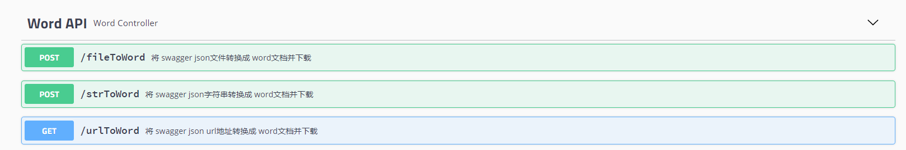
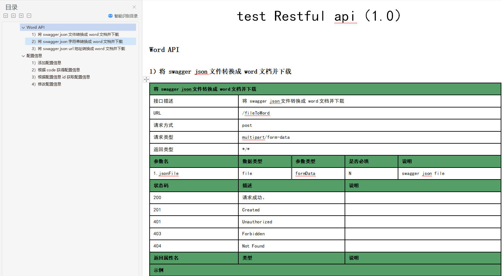

# swagger2doc

## 介绍
swagger文档转换工具，将swagger定义的接口转换为Word、PDF、markdown、eBook、HTML、DOCBOOK 等

## 软件架构
软件架构说明

## 如何使用

### 生成 HTML、PDF、EPUB3、DOCBOOK

#### 说明
支持将swagger.yaml、swagger.json或swagger URL地址,转换为asciidoc,继而转换成其他各种格式,如:HTML、PDF、EPUB3、DOCBOOK等
  主要用到了两个maven插件:
```
   1. swagger2markup-maven-plugin
   2. asciidoctor-maven-plugin
```

#### 操作步骤

 1. 配置swagger
 
  修改pom.xml中定义的<swagger.input>属性。如下：
  
 ```
<!--<swagger.input>${asciidoctor.resources}/swagger/swagger.json</swagger.input>-->
<!--<swagger.input>${asciidoctor.resources}/swagger/swagger.yaml</swagger.input>-->
<swagger.input>http://127.0.0.1:8089/v2/api-docs</swagger.input>
```

 2. 生成文档
 
 执行maven命令
 
 ```
 mvn test  
```

####  注意事项
1. 若你设计的API中没有用TAG分类,则必须将pom中的<swagger2markup.pathsGroupedBy>TAGS</swagger2markup.pathsGroupedBy> 改为AS-IS或者直接注释掉
2. pdf主题配置过于耗时,这里只是简单设置了下,如果对样式不满意,可以自行参考官方文档配置pdf的样式
3. 若要修改pdf文件字体可将fonts下的字体文件换成你的字体,并在custom-theme.yml中修改font -> catalog的配置,具体请参考[pdf文件样式设置指引](https://github.com/asciidoctor/asciidoctor-pdf/blob/master/docs/theming-guide.adoc)                                                  
4. 因为用到的两个插件不会自动执行,所以指定了插件执行所在的阶段为test,故maven插件目标包含test环节的命令都可以执行。执行完毕后,将在target/asciidoc下会看到生成的文档。

### 生成word

支持swagger2,swagger3,openapi3.0 生成Word，启动项目后，通过调用接口的方式生成文档。


#### 操作步骤  

 1. 执行执行DocApplication.java，启动工程
 2. 访问地址： http://127.0.0.1:8089/swagger-ui.html
 3. 选择文档生成方式，swagger2Word支持如下三种方式方式生成 word 文档：
 
  * swagger json 的资源地址： 例如：http://127.0.0.1:8089/v2/api-docs 
  * 可以通过上传 json 文件
  * 可以直接输入 json 字符串
  
  接口如下：
  
     
  
 3. 生成的 WORD 示例：  
 


####  注意事项   

模版定制及样式修改详见: resource/templates/word.html
  


## 参考链接:
> * [swagger2markupmaven插件官方文档](http://swagger2markup.github.io/swagger2markup/1.0.1/)
> * [asciidoctor maven插件官方文档](http://asciidoctor.org/docs/asciidoctor-maven-plugin/)
> * [pom中配置的asciidoctor属性说明](http://asciidoctor.org/docs/asciidoctor-maven-plugin/#configuration-options)
> * [asciidoctor maven插件中文说明](https://github.com/asciidoctor/asciidoctor-maven-plugin/blob/master/README_zh-CN.adoc)
> * [asciidoctor maven插件使用范例](https://github.com/asciidoctor/asciidoctor-maven-examples)
> * [pdf文件样式设置指引](https://github.com/asciidoctor/asciidoctor-pdf/blob/master/docs/theming-guide.adoc)
> * [pdf文件自定义字体设置参考](https://github.com/asciidoctor/asciidoctor-pdf/blob/master/docs/theming-guide.adoc#custom-fonts)
> * [swagger-gendoc](https://github.com/woshihoujinxin/swagger-gendoc.git)
> * [restdocs](https://github.com/quiterr/restdocs.git)
> * [swagger2word](https://github.com/JMCuixy/swagger2word/)
  
## 其他
如果觉得不错,请加个星,不甚感激!!!
